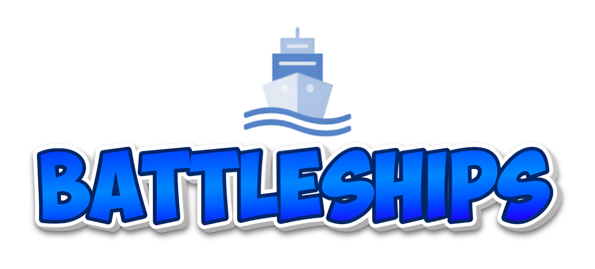

Players take turns attempting to hit their opponent's battleships, with the first player to sink all enemy ships declared the winner.

## Authors
Corey Hines
Ethan Field

# Building and Loading the Game
- Cloning the UCFK4 Software:
    1. Open a terminal window.
    2. Navigate to the directory you wish to store the UCFK4 software.
    3. Use the `git clone` command to clone the UCFK4 repository:
        ```
        git clone https://eng-git.canterbury.ac.nz/rmc84/ence260-ucfk4
        ```
- Cloning Battleships:
    1. Once you have the UCFK4 Software, navigate to the `ence260-ucfk4/assignments` directory.
    2. Use the `git clone` command to clone the Battleships repository:
        ```
        git clone https://eng-git.canterbury.ac.nz/ence260-2024/group_337
        ```
    3. Navigate to the `group_337` directory.
- Compiling
    - To compile the program, run `make`
    - To compile the program and send it to the UCFK4 , run `make program`
    - To clean up object and output files, run `make clean`

# How to Play
Players take turns trying to hit their opponent's ships. The objective is to sink all of the opponent's ships before they sink yours. The Blue LED is:

- on during your opponents turn
- off during your turn

## Selecting Player Order
1. Use the directional switch to select if you want to be player 1 or 2.
2. Press the button (S1) to confirm your select and move on to selecting ship layout.

## Selecting Ship Layout
1. Use the directional switch to move left or right and select from 5 defined (and one test) board.
2. Press the button (S1) to confirm your selection and move on to starting the game.

*Note: All boards contain the same number of ship cells, apart from the first board which is used for testing.*

## Sending a Shot
While is is your turn, the current cell you are point at is slowly flashing. Previous shots are displayed:

- A fast flashing light indicates a hit cell where a ship was hit.
- A static light indicates a hit cell where there was no ship.

When you hit a ship, a scrolling message will be shown to indicate if you hit their ship, or missed.

1. Use the directional switch to navigate the slow flashing light across the opponents board. 
2. Press down on the directional switch to send your shot.

## Winning/Losing
The goal of the game is to sink all of your opponents ships before they sink yours. Upon sinking your opponents last ship, a victory message will appear.  When your last ship is sunk, a loss message will appear.